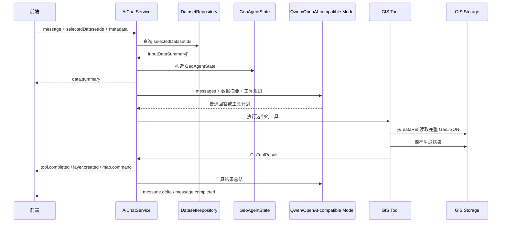

# 后端 geo-agent-service AI 聊天 GIS 工具链改造计划

## 1. 改造目标

`geo-agent-service` 的职责是维护 AI 会话状态，接收前端传来的轻量 GIS 上下文，把数据摘要注入模型，并在需要分析时通过工具读取完整 GIS 数据。

参考 NaLaMap 的实现逻辑，后端需要形成这样的边界：

- 模型只看数据集摘要、图层摘要、字段摘要、bbox、CRS、`dataRef`。
- 工具按 `datasetId/dataRef` 读取完整 GeoJSON。
- 工具执行空间分析、属性统计、图层生成。
- 工具结果保存为新 dataset。
- 后端通过 SSE 向前端发送工具状态、结果图层和地图命令。

## 2. 当前已有基础

项目中已有的相关能力：

- `modules/ai_chat` 已提供 `/api/ai-chat/sessions/{sessionId}/messages` SSE 接口。
- `ChatMessageRequest` 已包含 `selectedDatasetIds`、`selectedServiceIds`、`metadata`。
- `AgentSession` 已包含 `dataSummaries`、`toolCalls`、`layers`、`charts`、`sceneActions`、`report` 等字段。
- `modules/gis_data` 已支持 GeoJSON 上传、URL 注册、归一化保存、摘要生成和预览。
- `modules/layer_tree` 已支持用户图层树和数据集图层创建。
- `tools/base.py` 已定义 `GisTool` 和 `GisToolResult`。

当前主要缺口：

- `GisToolRegistry` 默认没有注册任何工具。
- `AiChatService._run_tools()` 当前会遍历所有工具执行，不适合真实 agent。
- 模型输入没有注入 `selectedDatasetIds` 对应的数据摘要。
- 没有统一的 `GeoAgentState`。
- 没有 metadata search、attribute summary、geoprocess、map command planner 等工具。
- 工具生成结果后还不能注册为新 dataset。
- 后端还没有发送 `data.summary`、`layer.created`、`map.command` 等 agent 事件。

## 3. 后端目标数据流



## 4. 建立 GeoAgentState

建议新增文件：

- `geo-agent-service/src/geo_agent_service/workflows/state.py`

建议结构：

```py
from typing import Any
from pydantic import BaseModel, Field

from geo_agent_service.modules.gis_data.schemas import InputDataSummary
from geo_agent_service.schemas.agent import MapLayerResult, ToolCallRecord
from geo_agent_service.schemas.session import AgentMessage


class GeoAgentState(BaseModel):
    session_id: str
    user_id: str
    messages: list[AgentMessage] = Field(default_factory=list)
    user_message: str
    selected_dataset_ids: list[str] = Field(default_factory=list)
    selected_service_ids: list[str] = Field(default_factory=list)
    data_summaries: list[InputDataSummary] = Field(default_factory=list)
    layer_context: list[dict[str, Any]] = Field(default_factory=list)
    map_context: dict[str, Any] = Field(default_factory=dict)
    tool_results: list[ToolCallRecord] = Field(default_factory=list)
    generated_layers: list[MapLayerResult] = Field(default_factory=list)
    map_commands: list[dict[str, Any]] = Field(default_factory=list)
```

它承担以下职责：

- 承载当前会话上下文。
- 区分模型可见摘要和工具可读完整数据引用。
- 支持多工具执行后的状态合并。
- 支持后续升级为 LangGraph 或其他 workflow。

## 5. 在聊天入口注入数据摘要

涉及文件：

- `geo-agent-service/src/geo_agent_service/modules/ai_chat/service.py`
- `geo-agent-service/src/geo_agent_service/modules/ai_chat/schemas.py`

改造点：

1. 在 `stream_message()` 中根据 `payload.selected_dataset_ids` 查询 `DatasetRepository`。
2. 将查询到的 `InputDataSummary` 写入 `session.data_summaries`。
3. 从 `payload.metadata.layers` 提取图层上下文。
4. 从 `payload.metadata.mapView` 提取地图视角。
5. 发送 `data.summary` SSE 事件。
6. 构造模型 prompt 时注入数据摘要。

建议新增方法：

```py
def _load_data_summaries(self, dataset_ids: list[str]) -> list[InputDataSummary]:
    summaries = []
    for dataset_id in dataset_ids:
        record = self.dataset_repository.get(dataset_id)
        if record is not None:
            summaries.append(record.summary)
    return summaries
```

模型上下文建议：

```text
当前可用 GIS 数据集：
1. dataset_school - 学校点位
   geometryType: Point
   featureCount: 328
   crs: EPSG:4326
   bbox: [116.1, 39.7, 116.7, 40.1]
   fields: name(string), type(string), student_count(number)
   dataRef: dataset:dataset_school

规则：
- 回答必须基于上面的真实数据摘要。
- 不要编造不存在的字段。
- 需要空间计算、属性统计、生成图层时调用工具。
- 不要要求用户重新上传已经存在于上下文的数据。
```

## 6. 扩展 SSE 事件

当前已有：

- `message.delta`
- `tool.started`
- `tool.completed`
- `tool.failed`
- `message.completed`
- `error`

建议新增：

- `data.summary`
- `plan.created`
- `layer.created`
- `map.command`
- `chart.created`
- `clarification`
- `done`

涉及文件：

- `modules/ai_chat/schemas.py`

`StreamEvent.type` 需要扩展 Literal。

`data.summary` 示例：

```json
{
  "type": "data.summary",
  "sessionId": "session_x",
  "data": {
    "datasets": [
      {
        "datasetId": "dataset_school",
        "name": "学校点位",
        "geometryType": "Point",
        "featureCount": 328,
        "bbox": [116.1, 39.7, 116.7, 40.1],
        "fields": []
      }
    ]
  }
}
```

`map.command` 示例：

```json
{
  "type": "map.command",
  "sessionId": "session_x",
  "data": {
    "commandId": "cmd_x",
    "command": {
      "action": "layer.addDataset",
      "datasetId": "dataset_result",
      "name": "学校缓冲区",
      "visible": true,
      "opacity": 0.8,
      "flyTo": true
    },
    "reason": "显示分析结果图层"
  }
}
```

## 7. 改造工具注册表

当前：

- `tools/registry.py` 只定义空注册表。
- `modules/ai_chat/routes.py` 中 `get_tool_registry()` 返回空 `GisToolRegistry()`。

建议新增默认工具工厂：

```py
def create_default_tool_registry(
    *,
    dataset_service: GisDatasetService,
) -> GisToolRegistry:
    registry = GisToolRegistry()
    registry.register(MetadataSearchTool(dataset_service=dataset_service))
    registry.register(AttributeSummaryTool(dataset_service=dataset_service))
    registry.register(GeoprocessTool(dataset_service=dataset_service))
    registry.register(MapCommandPlannerTool())
    return registry
```

涉及文件：

- `tools/registry.py`
- `modules/ai_chat/routes.py`

第一阶段可以只注册：

- `metadata_search`
- `attribute_summary`

## 8. 第一批 GIS 工具设计

### 8.1 `metadata_search`

建议文件：

- `tools/metadata_search.py`

用途：

- 在当前 `data_summaries` 中查找匹配用户问题的数据集。
- 回答“当前图层是什么数据”“有哪些字段”“哪个图层包含人口字段”等问题。

输入：

```json
{
  "query": "学校",
  "datasetIds": ["dataset_school"]
}
```

输出：

```json
{
  "matches": [
    {
      "datasetId": "dataset_school",
      "name": "学校点位",
      "score": 0.92,
      "reason": "名称和字段匹配"
    }
  ]
}
```

实现方式：

- 第一阶段用字符串匹配即可。
- 后续可接 embedding 或 BM25。

### 8.2 `attribute_summary`

建议文件：

- `tools/attribute_summary.py`

用途：

- 读取完整 GeoJSON，对字段进行统计。

支持能力：

- 分类字段计数。
- 数值字段 min/max/mean/sum。
- 空值率。
- 唯一值数量。

输入：

```json
{
  "datasetId": "dataset_school",
  "groupBy": "type",
  "metrics": [
    { "field": "student_count", "op": "sum" }
  ]
}
```

输出：

```json
{
  "datasetId": "dataset_school",
  "summary": {
    "groupBy": "type",
    "rows": [
      { "type": "小学", "count": 120, "student_count_sum": 30000 }
    ]
  }
}
```

数据读取：

- 通过 dataset repository 取 `record.summary.data_ref`。
- 用 `GisDatasetService.resolve_data_ref()` 获取文件路径。
- 用 GeoPandas 读取完整 GeoJSON。

### 8.3 `geoprocess`

建议文件：

- `tools/geoprocess.py`

用途：

- 生成新的空间结果数据集。

第一阶段支持：

- `buffer`
- `centroid`
- `bbox_clip`

输入：

```json
{
  "operation": "buffer",
  "datasetId": "dataset_school",
  "distance": 500,
  "unit": "meter",
  "resultName": "学校 500 米缓冲区"
}
```

输出：

```json
{
  "datasetId": "dataset_result",
  "dataRef": "dataset:dataset_result",
  "layer": {
    "id": "layer_result",
    "name": "学校 500 米缓冲区",
    "geometryType": "Polygon"
  },
  "mapCommand": {
    "action": "layer.addDataset",
    "datasetId": "dataset_result",
    "name": "学校 500 米缓冲区",
    "flyTo": true
  }
}
```

注意：

- 距离计算必须处理 CRS。没有投影时，先返回澄清或采用明确默认策略。
- 第一阶段可以限制只支持 EPSG:4326 输入，并自动转到合适投影后再转回。

### 8.4 `map_command_planner`

建议文件：

- `tools/map_command_planner.py`

用途：

- 生成前端可直接执行的地图命令。

支持：

- 定位图层。
- 添加数据集图层。
- 设置显隐。
- 设置透明度。
- 添加临时标记。

输出直接对应前端 `MapCommand` 类型。

## 9. 工具执行方式改造

当前 `AiChatService._run_tools()` 会遍历所有注册工具并执行。需要改为按需执行。

建议分两阶段：

### 阶段 A：规则选择工具

先不做模型 tool calling，用关键词规则快速跑通：

- 包含“字段、有哪些、是什么数据”：调用 `metadata_search`。
- 包含“统计、数量、分类、占比、平均、总和”：调用 `attribute_summary`。
- 包含“缓冲、附近、范围、裁剪、中心点”：调用 `geoprocess`。
- 包含“定位、显示、隐藏、透明度、标记”：调用 `map_command_planner`。
- 无工具意图：只让模型基于摘要直接回答。

### 阶段 B：模型输出工具计划

让模型输出受控 JSON：

```json
{
  "responseType": "tool_plan",
  "toolCalls": [
    {
      "toolName": "attribute_summary",
      "arguments": {
        "datasetId": "dataset_school",
        "groupBy": "type"
      }
    }
  ]
}
```

后端解析后执行工具。稳定后再升级到标准 tool calling。

## 10. 工具结果保存为新 dataset

`GisDatasetService` 需要新增生成结果注册能力。

涉及文件：

- `modules/gis_data/service.py`

建议方法：

```py
def register_generated_dataset(
    self,
    *,
    name: str,
    geodata: gpd.GeoDataFrame,
    source_tool_call_id: str,
    metadata: dict[str, Any] | None = None,
) -> InputDataSummary:
    ...
```

职责：

- 生成新的 datasetId。
- 写入 normalized GeoJSON。
- 生成 `InputDataSummary`。
- 保存 `DatasetRecord`。
- 返回 summary。

生成结果的 `source_type` 建议扩展为：

- 当前已有：`upload`、`url`
- 建议新增：`generated`

对应需要调整：

- 后端 `InputDataSummary.source_type`
- 前端 `InputDataSummary.sourceType`

## 11. 模型客户端改造

涉及文件：

- `modules/ai_chat/model_client.py`

当前模型客户端只面向普通流式回答。建议新增能力：

- 构造带 GIS 摘要的 system prompt。
- 支持非流式生成工具计划。
- 支持工具执行后再流式总结。

建议接口：

```py
async def plan_tools(
    self,
    *,
    messages: list[dict[str, str]],
    state: GeoAgentState,
    available_tools: list[dict[str, Any]],
) -> ToolPlan:
    ...

async def stream_final_response(
    self,
    *,
    messages: list[dict[str, str]],
    state: GeoAgentState,
) -> AsyncIterator[str]:
    ...
```

第一阶段可不拆接口，只在 `AiChatService` 中拼接 system prompt。

## 12. 会话状态持久化调整

`AgentSession` 已经有这些字段：

- `data_summaries`
- `tool_calls`
- `layers`
- `charts`
- `scene_actions`
- `report`

需要确保：

- 每次聊天都保存本轮 `selectedDatasetIds`。
- 每次聊天都保存实际注入的 `dataSummaries`。
- 工具调用记录写入 `toolCalls`。
- 生成图层写入 `layers`。
- 发送地图命令可写入 `sceneActions` 或新增 `mapCommands` 字段。

建议新增 `mapCommands` 字段，避免和 3D scene action 混淆。

## 13. 推荐实现顺序

### P0：数据摘要注入

- 根据 `selectedDatasetIds` 查询数据集摘要。
- 写入 `session.data_summaries`。
- 发送 `data.summary`。
- 将摘要拼进模型 prompt。

验收：

- 用户问“当前数据有哪些字段”，模型能基于真实字段回答。

### P1：工具注册和元数据工具

- 实现 `GeoAgentState`。
- 实现 `metadata_search`。
- 默认注册工具。
- `_run_tools()` 改为按需执行。

验收：

- 用户问“当前图层是什么”，工具能返回匹配数据集。

### P2：属性统计工具

- 实现 `attribute_summary`。
- 支持读取完整 GeoJSON。
- 支持分类计数和数值统计。

验收：

- 用户问“按类型统计数量”，返回真实统计。

### P3：空间处理和图层生成

- 实现 `register_generated_dataset()`。
- 实现 `geoprocess` 基础操作。
- 发送 `layer.created`。
- 发送 `map.command`。

验收：

- 用户问“给学校做 500 米缓冲区并显示”，后端生成新 dataset 并让前端加载。

### P4：模型工具计划

- 支持模型输出工具计划 JSON。
- 支持多步 plan。
- 支持 `plan.created`。
- 支持澄清问题 `clarification`。

验收：

- 多步骤空间分析能拆计划、执行工具、生成总结。

## 14. 后端验收清单

- 未选择数据集时，模型能说明当前没有可分析 GIS 数据。
- 选择数据集后，模型能看到真实 `name/fields/bbox/crs/featureCount`。
- `data.summary` 事件能正确返回。
- 工具只在需要时执行，不再无条件遍历全部工具。
- `attribute_summary` 能读取完整 GeoJSON 并返回真实统计。
- `geoprocess` 能生成新 dataset。
- 工具失败时返回 `tool.failed`，不会中断整个 SSE。
- 生成图层后能返回 `layer.created` 和 `map.command`。

## 15. 重点文件清单

需要修改：

- `geo-agent-service/src/geo_agent_service/modules/ai_chat/service.py`
- `geo-agent-service/src/geo_agent_service/modules/ai_chat/schemas.py`
- `geo-agent-service/src/geo_agent_service/modules/ai_chat/model_client.py`
- `geo-agent-service/src/geo_agent_service/modules/ai_chat/routes.py`
- `geo-agent-service/src/geo_agent_service/modules/gis_data/service.py`
- `geo-agent-service/src/geo_agent_service/modules/gis_data/schemas.py`
- `geo-agent-service/src/geo_agent_service/tools/base.py`
- `geo-agent-service/src/geo_agent_service/tools/registry.py`
- `geo-agent-service/src/geo_agent_service/schemas/session.py`

建议新增：

- `geo-agent-service/src/geo_agent_service/workflows/state.py`
- `geo-agent-service/src/geo_agent_service/tools/metadata_search.py`
- `geo-agent-service/src/geo_agent_service/tools/attribute_summary.py`
- `geo-agent-service/src/geo_agent_service/tools/geoprocess.py`
- `geo-agent-service/src/geo_agent_service/tools/map_command_planner.py`
- `geo-agent-service/src/geo_agent_service/workflows/tool_planner.py`

## 16. 最小可交付版本

最小版本只需要完成：

1. 聊天入口根据 `selectedDatasetIds` 查询数据摘要。
2. 将数据摘要注入模型 prompt。
3. 发送 `data.summary`。
4. 实现 `attribute_summary`，能读取完整 GeoJSON 做真实字段统计。
5. 工具结果参与最终自然语言回答。

这个版本跑通后，后端就具备核心架构：模型读摘要，工具读完整数据，结果通过结构化事件返回前端。
